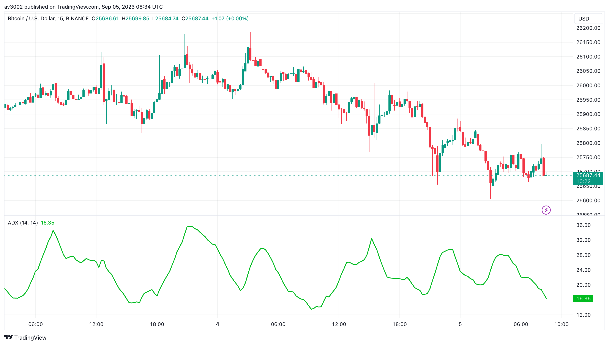
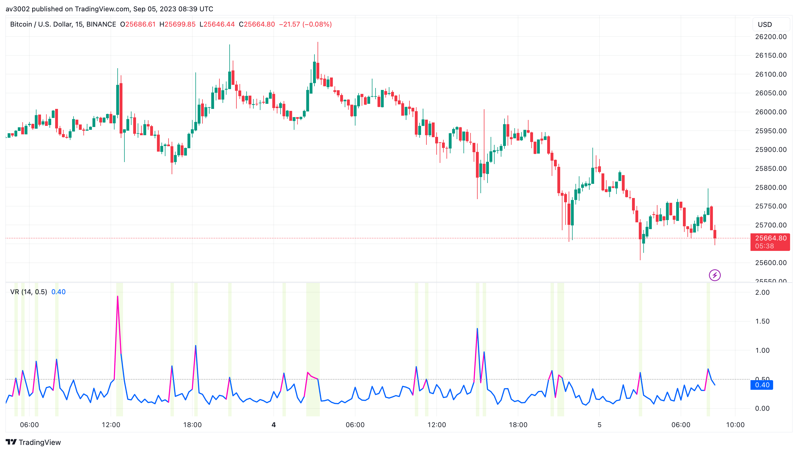
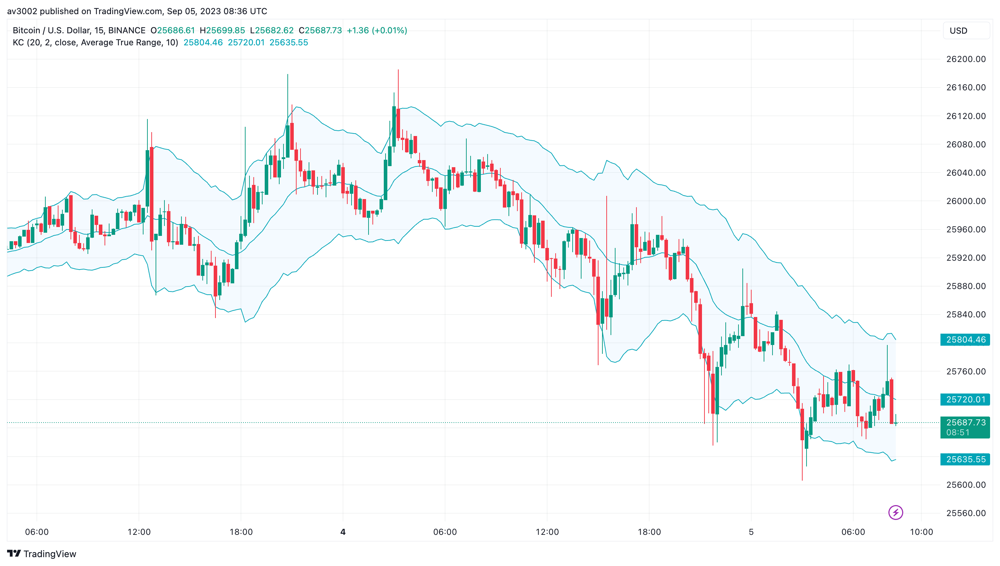
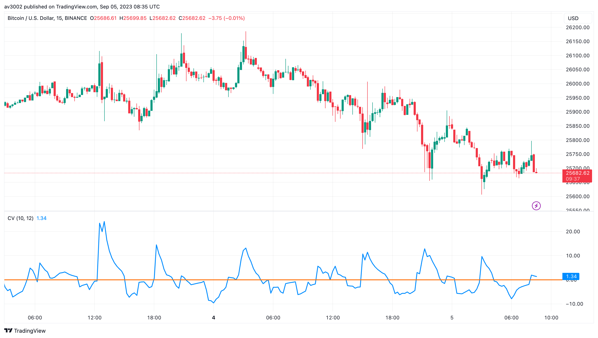

# Volatility Indicators for TradingView 📈💹

Welcome to the Volatility Indicators repository! These technical indicators are essential tools for traders and investors to analyze and understand market dynamics. They provide valuable insights into trend strength, market sentiment, and volatility, aiding in making informed trading decisions.

## Included Indicators 📊

1. Average Directional Index (ADX)
2. Volatility Index (VIX)
3. Keltner Channels
4. Chaikin Volatility
5. Volatility Ratio

## Indicator Details 📝

### Average Directional Index (ADX) 📈

The Average Directional Index (ADX) measures the strength of a trend's momentum. It helps traders identify the strength of a trend, making it a crucial tool for trend-following strategies.

**Use Case:**
ADX helps traders determine the strength of a trend, allowing them to focus on strong trends and avoid weak or sideways markets.

**How to Use:**
To use the Average Directional Index (ADX) indicator, follow these steps:
1. Calculate the ADX value based on the average of positive and negative directional movement indices (DMI) over a chosen period (e.g., 14).
2. ADX values above 25 indicate a strengthening trend, while values below 20 suggest a weak trend or range-bound market.
3. Use ADX in conjunction with other technical indicators to confirm trend strength.

### Volatility Index (VIX) 📊

The Volatility Index (VIX) gauges market sentiment and volatility. It is often referred to as the "fear gauge" as it indicates the market's expectation of future volatility.

**Use Case:**
VIX helps traders assess market sentiment and anticipate potential market movements during periods of high volatility.

**How to Use:**
To use the Volatility Index (VIX) as an indicator, follow these steps:
1. Monitor the VIX value regularly.
2. Higher VIX values suggest increased market uncertainty and potential for larger price swings.
3. Use VIX in conjunction with other market analysis tools to make informed trading decisions.

### Keltner Channels 🧰

Keltner Channels are similar to Bollinger Bands but use the Average True Range (ATR) to set bands. They help traders identify potential breakouts and trend reversals.

**Use Case:**
Keltner Channels can be used to confirm trend direction and identify potential breakout points.

**How to Use:**
To use Keltner Channels as an indicator, follow these steps:
1. Calculate the middle line using an exponential moving average (EMA) of the asset's price.
2. Calculate the upper and lower bands based on the EMA and a multiplier (typically 1 to 2 times the ATR).
3. Observe price interactions with the bands:
   - Price crossing above the upper band may indicate a potential bullish breakout.
   - Price crossing below the lower band may indicate a potential bearish breakout.
4. Use Keltner Channels in conjunction with other indicators to confirm trade signals.

### Chaikin Volatility 📉

Chaikin Volatility measures market volatility based on the spread between high and low prices. It assists traders in assessing the potential for price movements.

**Use Case:**
Chaikin Volatility helps traders gauge the potential for price swings and adjust their trading strategies accordingly.

**How to Use:**
To use Chaikin Volatility as an indicator, follow these steps:
1. Calculate Chaikin Volatility using the difference between the highest high and lowest low over a specified period (e.g., 10).
2. Higher Chaikin Volatility values suggest increased market volatility.
3. Monitor Chaikin Volatility to identify potential trading opportunities during volatile market conditions.

### Volatility Ratio 🔍

The Volatility Ratio compares the Average True Range (ATR) to a moving average, aiding traders in identifying shifts in volatility.

**Use Case:**
The Volatility Ratio helps traders detect changes in market volatility, which can be useful for adjusting risk management strategies.

**How to Use:**
To use the Volatility Ratio as an indicator, follow these steps:
1. Calculate the ATR over a specified period (e.g., 14).
2. Calculate a moving average (e.g., simple moving average) of the ATR over another specified period (e.g., 20).
3. Compare the ATR to the moving average to determine whether volatility is increasing or decreasing.
4. Use the Volatility Ratio to adapt your trading strategy to current market conditions.

## Usage and Instructions 🚀

To use these indicators in TradingView, follow these steps:

1. Copy the PineScript code for the desired indicator.
2. Open TradingView and create a new indicator.
3. Paste the copied code into the PineScript editor.
4. Customize the indicator's settings as needed.
5. Apply the indicator to your chart.

Feel free to explore and use these indicators to enhance your trading strategies and make more informed decisions in the dynamic world of stock market trading. Happy Trading! 📈💰